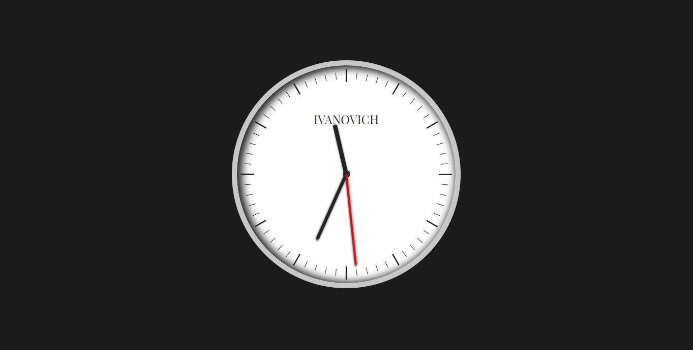

# Analog-Clock

<h1>
    Analog Clock using HTML - CSS - Native Javascript
</h1>

 
    HTML: Basic Structure

 
    CSS: Shadow and pointers

 
    Javascrip: Get Time, hours and minutes/seconds marks are generated with javascript, pointers move
    by javascript.

